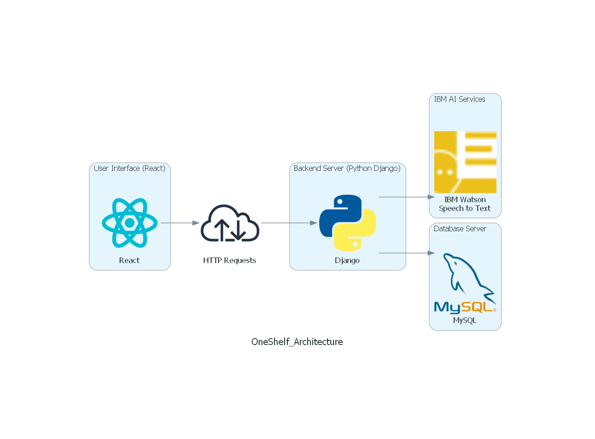
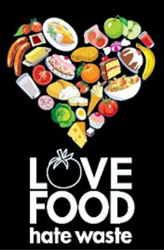

 

# Offshelf

- [Project summary](#project-summary)
  - [The issue we are hoping to solve](#the-issue-we-are-hoping-to-solve)
  - [How our technology solution can help](#how-our-technology-solution-can-help)
  - [Our idea](#our-idea)
- [Technology implementation](#technology-implementation)
  - [IBM AI service(s) used](#ibm-ai-services-used)
  - [Other IBM technology used](#other-ibm-technology-used)
  - [Solution architecture](#solution-architecture)
- [Presentation materials](#presentation-materials)
  - [Solution demo video](#solution-demo-video)
  - [Project development roadmap](#project-development-roadmap)
- [Additional details](#additional-details)
  - [How to run the project](#how-to-run-the-project)
  - [Live demo](#live-demo)
- [About this template](#about-this-template)
  - [Contributing](#contributing)
  - [Versioning](#versioning)
  - [Authors](#authors)
  - [License](#license)
  - [Acknowledgments](#acknowledgments)

## Project summary

### The issue we are hoping to solve

It is estimated that around 17 percent of total global food production is wasted in households. In a world where an estimated one in three people do not have access to adequate food this is a huge waste and it also impact the environment as this is also a major source of greenshouse gas emissions. Our project aims to reduce this food wastage at the household by promoting responsible consumption and community collaboration.

### How our technology solution can help

Our solution enables users to track food inventory, recieve expiry notification and share surplus item within community thereby reducing the chances of good food going bad.

### Our idea

The primary objective of Offshelf is to reduce household food wastage by implementing a comprehensive system that allows efficient tracking of fresh and packaged food items, monitor their expiry and notify users to utilize them before they go bad. Additionally we aim to create a community marketplace for sharing surplus food within the community thereby reducing wastage at a broader scale.

The user can easily input and manage their stocked food items. Once an item is added the expiry dates for the same is tracked and timely automated notification is pushed to the users reducing likelihood of food wastage due to neglect.

Even with the notifications in place there is still a possibility of wastage as many a times people tend to over stock items, specially fresh fruits & vegetables, which could not be consumed in time. To handle this scenario we propose to go a step further and provide a platform to facilitate sharing of surplus food items within the community. The users can list items they won't use and connect with neighbours who can benifit from them.

Reducing food waste not only saves money but also plays a vital role in conserving resources and reducing green housegas emissions. This platform aligns with global effort to combat climate change and promotes sustainable leaving.

## Technology implementation

### IBM AI service(s) used

- [Watson Speech to Text](https://cloud.ibm.com/catalog/services/speech-to-text) - Watson Speech to Text service has been used to accept user voice input and auto populate/submit forms.

### Other IBM technology used

- [IBM Carbon Design Components](https://carbondesignsystem.com/) - The IBM Carbon Design Components have been used extensively for designing the User Interfaces which includes themes, forms, buttons etc.

### Solution architecture

## Presentation materials

### Solution demo video

### Project development roadmap

The project currently does the following things.

- User Registration & Authentication: This module allows users to register with the platform and provides authentication services.
- Inventory Tracking: This module allows users to easily input and manage stock of food items through a user-friendly interface. Users can categorize items, input quantities and specify expiry dates.
- Voice Recognition: This module powered by IBM Watson Speech to Text service provides voice understanding and allows users to input inventory details using voice.
- Dashboard: Provides a detailed listing of invntory organized by category and  expiry dates. Additonally it also provides reports on amount of food consumed, saved and wasted on a monthly basis. This designed to track the reduction in waste achieved over time and prompte sustaiable and responsible living.

In the future we plan to...

- Expiry Notification: In addition to dashboards the system will generate automated notifications before expiry of food items at configured intervals as a proactive effort to reduce likelihood of wastage due to neglect.

- Marketplace: Provide a dedicated platform to facilitate sharing of surplus food items within community.

- Image recognition: Read product labels to extract item details like category, expiry dates and directly save to build up the inventory faster. Also support extraction of data from invoices wherever possible.
 

## Additional details

### How to run the project

docker  network create my-net

docker run -d--name mysql-container --network my-net -e MYSQL_ROOT_PASSWORD=mysql12345 -e MYSQL_DATABASE=offshelf mysql:8.0.1

 

---------------------------------------------------------------------------------------------------------

Note: 

docker inspect -f '{{range .NetworkSettings.Networks}}{{.IPAddress}}{{end}}' mysql-container

 

take the ip address and put it in /etc/hosts file

<ip>  mysql-container

--------------------------------------------------------------------------------------------------------

docker run -it --name django-container --network my-net -p 8000:8000 rajdeep662/offshelf4.3

Access the static website at <a href="https://son-ya123.github.io/offShelf/dashboard"> this </a> location  or follow the steps in [Steps to run locally](./offshelf-react-app/README.md) to run the frontend code locally

### Authors

[Soniya](https://github.com/son-ya123)
[Siti](https://github.com/SitiNorhanisa)
[Rajdeep](https://github.com/Rajdeep2000)
[Jayatu](https://github.com/jayatuB)
[Rahizal](https://github.com/reyzeck)

### License

This project is licensed under the Apache 2 License - see the [LICENSE](LICENSE) file for details.

### Acknowledgments

- Based on [Billie Thompson's README template](https://gist.github.com/PurpleBooth/109311bb0361f32d87a2).
